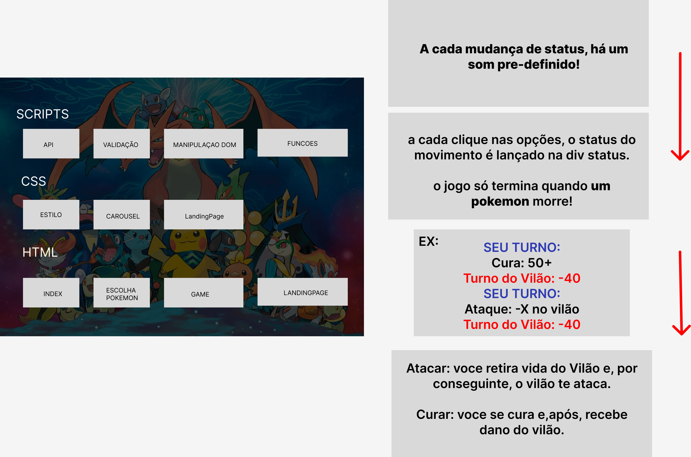

<h1>Mate o Vilão - Pokedex</h1>

A Pokédex no mundo fictício dos Pokémon é um dispositivo eletrônico que intervém nos videogames e nas séries de anime. Nos jogos, sua função é registrar os dados de um Pokémon. No manga e no anime, o Pokédex é uma enciclopédia eletrônica, que fornece ao treinador informações sobre um pokémon que é desconhecido simplesmente expondo o Pokédex na frente dos pokémon.

No entanto, esta aplicação vai ser usada para simular o uso destes pokemons para simular uma batalha "real"

Diante aos milhares de "joguinhos" da infância, recordo de quando brincava de simular batalhas entre pokemons e esta aplicação web vêm com esta possibilidade de trazer novamente cada emoção vivida naqueles momentos.

<h2>Desenvolvimento</h2>

1- Levantamento de Requisitos

2- Modelagem e arquitetura do sistema

3- Codificação

<h3>Levantamento de Requisitos</h3>

<h3>Modelagem e arquitetura do sistema</h3>

<h3>Codificação</h3>
  
  
  

  <h5>Inspiração</h5>
  
https://github.com/devmediadev/desafio_pokemon

  
