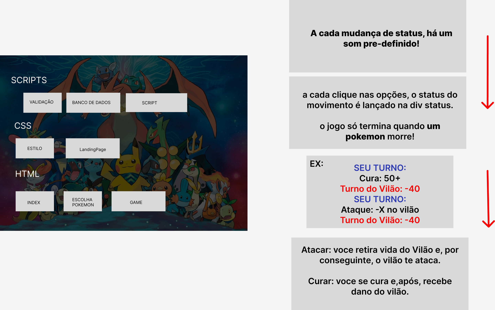

<h1>Mate o Vilão - Pokedex</h1>

Diante aos milhares de "joguinhos" da infância, recordo de quando brincava de simular batalhas entre pokemons e esta aplicação web vêm com esta possibilidade de trazer novamente cada emoção vivida naqueles momentos.

<h2>Desenvolvimento</h2>

Levantamento de Requisitos

Modelagem e arquitetura do sistema

Codificação

Testes

<h3>Levantamento de Requisitos</h3>

<h3>Modelagem e arquitetura do sistema</h3>

<h3>Codificação</h3>
 
  
  

  <h5>Inspiração</h5>
  
https://github.com/devmediadev/desafio_pokemon

  
API: https://pokeapi.co/
